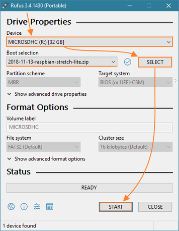
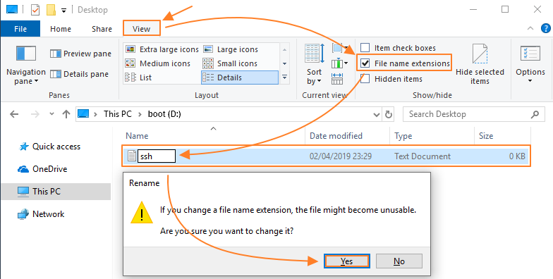

# Raspberry Pi with UniFi Controller and Pi-hole from scratch (headless)

> [Original Post](https://community.ubnt.com/t5/UniFi-Routing-Switching/Step-By-Step-Tutorial-Guide-Raspberry-Pi-with-UniFi-controller/td-p/2470231) is linked in the upstream repo, but it is out of date so this is the improved version in markdown hosted on github for ease of updating and version tracking.

Post Introduction:

> Greetings,
> 
> Thought I'd make a step-by-step tutorial for anyone looking for a straight forward installation of both the UniFi Controller (version 5.10.X or lower) and Pi-hole (Advertisement Blocking DNS server) without needing to hook up the Raspberry Pi to a monitor with keyboard and mouse (headless). You can install one without the other as well.
> 
> If you still have questions or if I forgot to explain some part you're stuck at, please post here so I can add this to the tutorial.
> 
> Dutch version: https://gathering.tweakers.net/forum/list_messages/1873125

Remainder of guide is re-created in Markdown by [@ChadBailey](https://github.com/ChadBailey/)

> NOTE: Not all steps have been validated or tested, this is just as close to a 1:1 translation as I could do with some tweaks here and there.

# <a name="prerequisites"></a>Prerequisites

 - Raspberry Pi 3 model B(+) with a MicroSD card of atleast 4GB
 - Ethernet cable to connect it to an existing network
 - capability to connect the MicroSD card to a computer via a card reader

# <a name="steps"></a>Installing UniFi Controller on Raspberry Pi

## <a name="download"></a>Download the necessary tools and raspbian operating system image

1. Raspbian Stretch Lite (= without desktop interface) through the ZIP option (or torrent).

    a. https://www.raspberrypi.org/downloads/raspbian/
  
    b. Direct: https://downloads.raspberrypi.org/raspbian_lite_latest

2. Rufus to install the image on to the MicroSD card.

    a. https://rufus.akeo.ie

    b. Direct: https://github.com/pbatard/rufus/releases/download/v3.5/rufus-3.5.exe

3. Advanced IP Scanner to figure out the assigned IP address of your Raspberry Pi.

    a. http://www.advanced-ip-scanner.com
    
    b. Direct: http://www.advanced-ip-scanner.com/download/Advanced_IP_Scanner_2.5.3850.exe
 
4. If you are _not_ using Windows 10, you can use PuTTY instead of the command prompt to connect to your Raspberry Pi.

    a. https://www.chiark.greenend.org.uk/~sgtatham/putty/latest.html

    b. Direct: https://the.earth.li/~sgtatham/putty/latest/w64/putty-64bit-0.71-installer.msi

5. If you are having issues with the partitions on your MicroSD card, I recommend using MiniTool Partition Wizard. This program makes it very easy to start from scratch by removing every partition on your MicroSD and creating a new Fat32 partition.

    a. https://www.partitionwizard.com/free-partition-manager.html
    
    b. Direct: https://www.partitionwizard.com/download/v11/pw11-free.exe
    
## <a name="install"></a>Install Raspbian Lite on the MicroSD

1. Open Rufus (or preferred imaging software)

2. Make __sure__ you have the correct MicroSD card selected (This operation wipes all data on all partitions of the device selected)

3. Press START

4. Accept the warning about removing all data

    a. 

5. Wait until process completes (~1-5 minutes typical)

6. Windows may ask you to format the Linux partition, __do not do this__, just cancel the request.

## <a name="enable_ssh"></a>Enable SSH on Raspbian Lite

1. Enable SSH before starting the Raspberry Pi by adding a new text file to the main folder of the MicroSD card (boot partition). Rename this text file to `ssh` and remove the .txt extension.

    a. 

2. The MicroSD is ready now, insert it into your raspberry pi, connect an ethernet cable and turn on the Raspberry Pi.

## <a name="ip"></a>Find your Raspberry Pi's IP address

1. If you’re using Advanced IP Scanner, you can simply press `Scan` and wait until the Raspberry Pi shows up (typically shows up as raspberrypi.localdomain).

## <a name="login_ssh"></a>Log in via SSH

### <a name="ssh_putty"></a>Windows XP/7/etc. (PuTTY)

1. Open PuTTY

2. Enter IP address found in `Find your Raspberry Pi's IP address` in the Host Name (or IP address) field

3. Accept warning about new SSH certificate.

4. Log in

    a. Default username: pi
    
    b. Default password: raspberry
    

### <a name="ssh_terminal"></a>Windows 10/MacOS/Linux

1. Open a terminal/command line

    a. For Windows 10 users, `Win+R` then type `cmd` and hit enter
    
2. Connect to SSH by typing `ssh pi@[pi's hostname/IP]`  of course, replace `[pi's hostname/IP]` with the IP address found in `Find your Raspberry Pi's IP address`

    a. Default password: raspberry
    
3. Accept warning about authenticity

# <a name="update"></a>Update Pi & Install Packages

## <a name="script"></a>Option 1: Use script to save time

> I've added all the following commands into a simple script that I share through my GitHub project. By entering the line of code right after you login into your Raspberry Pi, you will not have to copy/paste all of these commands. You also get to choose your Stable version of the UniFi controller you wish to install.
>
> If you wish to check the script before executing, you can look at the code [here](install-unifi-pihole-English.sh)

### Ubiquiti Controller + PiHole

1. Download/execute the script

    a. Right click [this link](install-unifi-pihole-English.sh) and copy link address.
    
    > NOTE: Also available in [Nederlands](install-unifi-pihole-Nederlands.sh)

    b. Enter this command in the logged in Raspberry Pi terminal: `wget "*link from previous step*" -O install-unifi-pihole.sh && chmod +x install-unifi-pihole.sh && ./install-unifi-pihole.sh`

2. Answer any prompts, this concludes the guide - all below steps relate to [Option 2: Proceed Manually](#manual)

### Ubiquiti Controller Only

1. Download/execute the script

    a. Right click [this link](install-unifi-pihole-English.sh) and copy link address.
    
    > NOTE: Also available in [Nederlands](install-unifi-pihole-Nederlands.sh)

    b. Enter this command in the logged in Raspberry Pi terminal: `wget "*link from previous step*" -O install-unifi-pihole.sh && chmod +x install-unifi-pihole.sh && ./install-unifi-pihole.sh no-pihole`
 
2. Answer any prompts, this concludes the guide - all below steps relate to the second option to manually install

## <a name="manual"></a>Option 2: Proceed Manually

### Set Raspberry Pi System Password

1. It's very unsafe to keep the default password, so we'll change it. After entering the passwd command, it'll ask you to type the current password once and your new password twice.

    ```
    pi@raspberrypi:~ $ passwd
    Changing password for pi.
    (current) UNIX password:
    Enter new UNIX password:
    Retype new UNIX password:
    passwd: password updated successfully
    ```

### Update Raspberry Pi System

1. Install updates and clean up any unused/old ones by executing the following command:
    
    ```
    sudo apt-get update && sudo apt-get upgrade -y && sudo apt-get autoremove && sudo apt-get autoclean
    ```

### Install OpenJDK

1. The default available Java version from Oracle is too old to make the 5.10.X UniFi controller work. Instead of doing multiple extra commands to upgrade this version, we're just going to install OpenJDK.

    ```
    sudo apt-get install openjdk-8-jre-headless -y
    ```

### Install Haveged (Prevent slow-boot condition)

> In order to fix the slow start-up of the UniFi controller, we have to install haveged.
> The reason for the slow start-up is basically the lack of user interaction (no mouse movements) causing issues with the standard mechanisms for harvesting randomness. Luckily the fix is an easy one

1. Issue the following command:

    ```
    sudo apt-get install haveged -y
    ```
    
# Install UniFi Controller

> Not required if you chose [Option 1: Use script to save time](#script)

## Method A (Recommended): Install using .deb file from website

> This method manually installs the Controller by using the download link on the website/update blog.
> 
> Easily install any Controller version you want, whenever you want. As soon as the blog comes out.
> If you're not using the script, it'll take more commands to update your Controller in the future

1. Download Controller

    > Optionally, you can visit the [UniFi Updates Blog](https://community.ubnt.com/t5/UniFi-Updates-Blog/bg-p/Blog_UniFi) to find a specific version

    a. Visit the [UniFi Download Page](https://www.ui.com/download/unifi/) and locate the controller of your choice in the __SOFTWARE__ section (not the FIRMWARE section). The one you are looking for will be labeled in this format `UniFi Network Controller [version] for Debian/Ubuntu Linux and UniFi Cloud Key`.
    
    b. Click Download
    
    c. Click `I ACCEPT`, so long as you accept of course
    
    d. A `Direct URL:` box should appear, click `COPY URL` or just copy it manually. It should be in this format: `https://dl.ubnt.com/unifi/[version]/unifi_sysvinit_all.deb`
    
    e. Download using wget:
    
    ```
    wget https://dl.ubnt.com/unifi/[version]/unifi_sysvinit_all.deb
    ```
    
2. Install UniFi and its dependencies

    > NOTE: There is no harm in issuing these commands separately, but you will notice the first one results in an error. This is intentional and required as issuing the followup command `sudo apt-get install -f -y` performs a `fixup` on the previous install attempt and installs the .deb file. Issuing the dpkg -i command a second time is not necessary.
    
    ```
    sudo dpkg -i unifi_sysvinit_all.deb; sudo apt-get install -f -y
    ```

## Method A Updating (Not needed during initial installation)

### Method A Using script to update

> Here is a simple script for updating your system, Controller and Pihole in one go.
> Simply enter ./update.sh in the future to use the script again without having to redownload it.

1. Right click [this link](update-unifi-pihole-English.sh) and copy the URL location.

2. Run this command, replacing the url with the one gotten from step 1.

    ```
    wget "[link from step 1]" -O update.sh && chmod +x update.sh && ./update.sh
    ```

### Method A Manually Updating

1. Remove the old downloaded UniFi Controller package

    ```
    rm unifi_sysvinit_all.deb
    ```

2. Download the new UniFi Controller package, adjust the link below for the version you want to install.

    ```
    wget http://dl.ubnt.com/unifi/x.x.xx/unifi_sysvinit_all.deb
    ```


## Method B (Not Recommended): Add ubiquiti to apt

1. Add a new source to the list of sources from which packages can be obtained with 'apt'

    ```
    echo 'deb http://www.ubnt.com/downloads/unifi/debian stable ubiquiti' | sudo tee /etc/apt/sources.list.d/100-ubnt-unifi.list
    ```

2. Add the GPG keys

    ```
    sudo wget -O /etc/apt/trusted.gpg.d/unifi-repo.gpg https://dl.ubnt.com/unifi/unifi-repo.gpg
    ```

3. Update the package list and install UniFi

    ```
    sudo apt-get update; sudo apt-get install unifi -y
    ```

# Install [Pi-hole](https://pi-hole.net/) (Optional)

> NOTE: This provides network-wide Ad Blocking. Caution: Ad blocking _can_ cause unexpected website behavior.

1. Download/install using automated method

    ```
    curl -sSL https://install.pi-hole.net | bash
    ```

    > NOTE: Visit the [pi-hole docs](https://github.com/pi-hole/pi-hole/#one-step-automated-install) for alternative/updated installation instructions if this does not work

    ```
    > Choose an interface:
    (*) eth0  (= ethernet cable)

    > Choose your DNS provider
    Custom
    1.1.1.1, 8.8.8.8
    (= fast cloudflare dns & basic Google dns)

    > Choose your adblocking providers
    leave them enabled

    > IPv4 and/or IPv6
    both

    > PiHole wants to set a static IP. Let it do its thing.
    I guess they haven’t heard of DHCP reservation/central management yet.

    > Install the Web admin interface and the web server 
    ```

2. Change the pi-hole web interface admin password

    ```
    pi@raspberrypi:~ $ pihole -a -p
    Enter New Password (Blank for no password):
    Confirm Password:
      [✓] New password set
   ```


# Visit/Configure newly-installed UniFi Controller

1. Visit your UniFi Controller in your browser using the [IP address](#ip) and default UniFi Controller port (8443). Example: `https://192.168.1.2:8443`

    a. You will receive a security warning from your well-meaning browser. You will need to expand your options and tell your browser to proceed anyway. You will be warned about this being not recommended or unsafe.
    
    > NOTE: This is due to the security certificate being self-signed. To a computer this looks like a forged signature so this is why you get this warning. Since this is a locally-hosted server, a self-signed certificate is used.

2. It is recommended to set a reserved IP for Raspberry Pi in the UniFi Controller's interface

3. If you would like to configure the controller from the Internet/outside of your local network, you will need to enable port forwarding.

    > TODO: Add additional steps/details for for steps 2 and 3
